# Loan  Approval Prediction
- [Loan  Approval Prediction](#loan--approval-prediction)
  - [Data analysis](#data-analysis)
    - [Typical Features in the Loan Prediction Dataset](#typical-features-in-the-loan-prediction-dataset)
    - [visualization of data](#visualization-of-data)
  - [Data Preprocessing](#data-preprocessing)
  - [Model](#model)
    - [Evaluation of implemented models](#evaluation-of-implemented-models)
      - [RandomForestClassifier:](#randomforestclassifier)
      - [GaussianNB:](#gaussiannb)
      - [DecisionTreeClassifier](#decisiontreeclassifier)
      - [LogisticRegression](#logisticregression)
  - [UI  for user interaction using streamlit:](#ui--for-user-interaction-using-streamlit)
  - [project discription](#project-discription)
  - [References](#references)

## Data analysis
In a loan prediction project, the goal is to build a machine learning model that can predict whether a loan application will be approved or not based on various factors. The data used for this project typically comes in the form of a CSV file containing information about previous loan applications. Each row in the dataset represents a loan application, and each column represents a specific feature or characteristic of the loan application.

For this task dataset link is provided here :
[dataset](https://drive.google.com/drive/folders/1cQHa3FngeeDsJHDS3rgPm5HWy7KTN37A)
### Typical Features in the Loan Prediction Dataset

Here’s a breakdown of common features  in a loan prediction dataset: 

- **Loan_ID:** A unique identifier for each loan application. This column is generally not useful for prediction and is often removed during preprocessing.

- **Gender:** The gender of the applicant (e.g., Male, Female). This categorical feature might help understand patterns related to loan approvals.

- **Married:** Whether the applicant is married (Yes/No). This feature can be useful in understanding the social and economic background of the applicant.

- **Dependents:** The number of dependents (e.g., 0, 1, 2, 3+). This feature can indicate the financial burden on the applicant.

- **Education:** The education level of the applicant (e.g., Graduate, Not Graduate). Higher education levels might correlate with better income prospects.

- **Self_Employed:** Whether the applicant is self-employed (Yes/No). Employment type might impact the stability of income.

- **ApplicantIncome:** The monthly income of the applicant. This numerical feature is a key indicator of the applicant’s ability to repay the loan.

- **CoapplicantIncome:** The monthly income of the co-applicant (if any). This can contribute to the total income available for repaying the loan.

- **LoanAmount:** The amount of loan applied for. Larger loan amounts might be harder to repay, affecting the loan approval decision.

   **Loan_Amount_Term: **The term of the loan in months. This indicates the repayment duration.

- **Credit_History:** A categorical feature indicating whether the applicant has a history of credit repayment (1 = Yes, 0 = No). A positive credit history is usually a strong indicator of loan approval.

-  **Property_Area:** The type of area where the property is located (e.g., Urban, Semiurban, Rural). This might reflect the economic conditions of the applicant’s environment.

- **Loan_Status:** The target variable indicating whether the loan was approved or not (Y = Yes, N = No). This is what the model aims to predict.

Analyzing the distribution of different features is a crucial step in understanding your dataset before training a machine learning model. It helps in identifying patterns, outliers, and potential issues that might affect the performance of model. 

The dataset analysis is done in preprocess.py. For the analysis, we performed several operations:

1. Displayed and described the data.
2. Checked for null values and filled them with the mode value.
3. Visualized the distribution of both categorical and numerical features.
   
### visualization of data
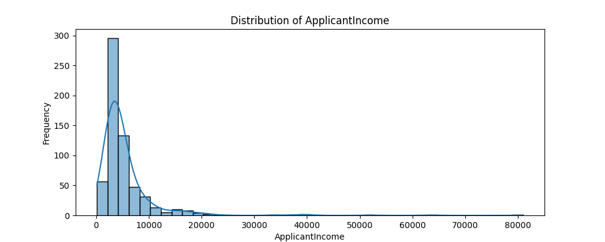
<p align="center">fig 1:data distrubution of applicant income </p>

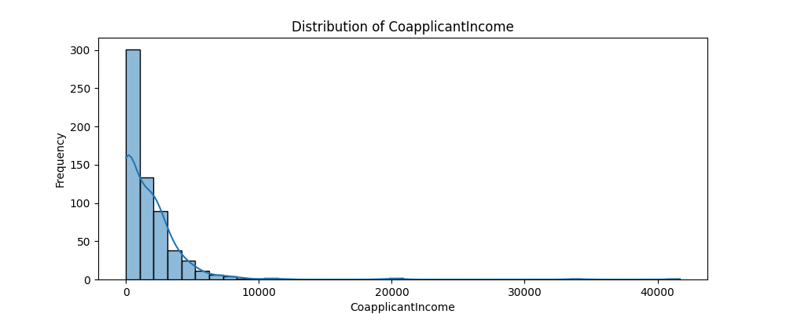
<p align="center">fig 2:data distrubution of CoapplicantIncome </p>

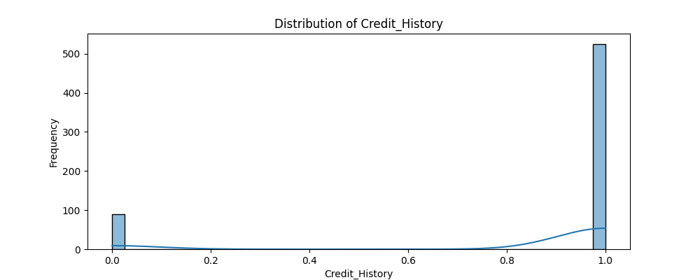
<p align="center">fig 3:data distrubution of Credit_History </p>

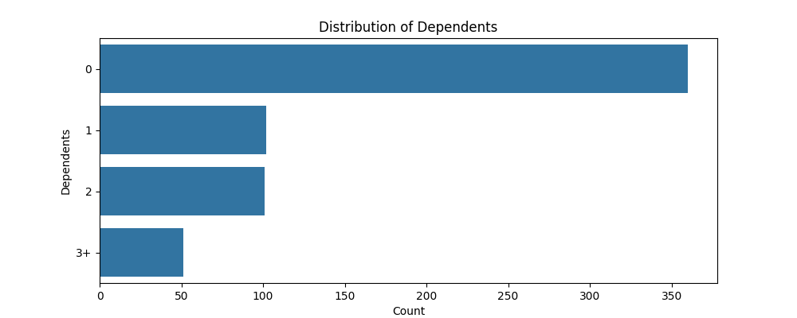
<p align="center">fig 4:data distrubution of Dependents</p>

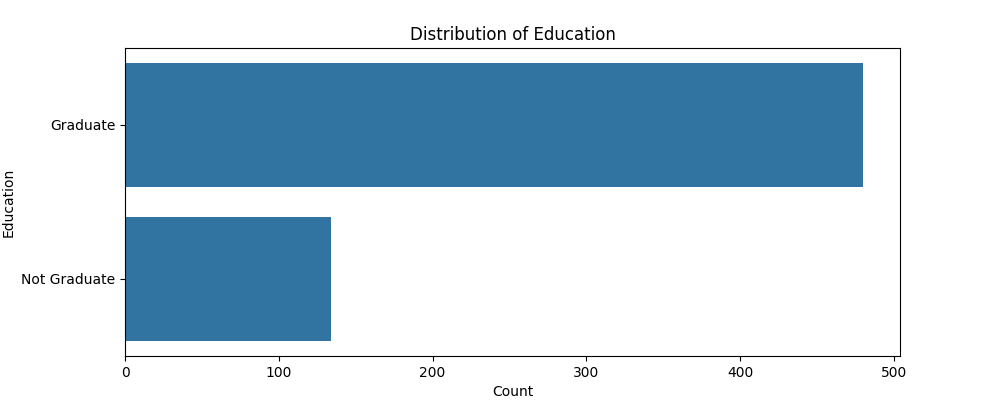
<p align="center">fig 5:data distrubution of Education</p>

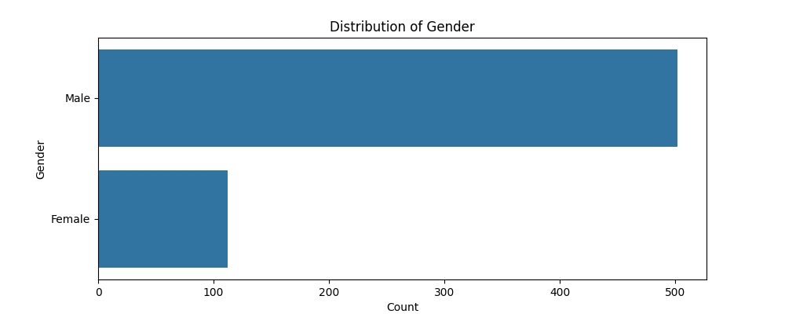
<p align="center">fig 6:data distrubution of Gender</p>

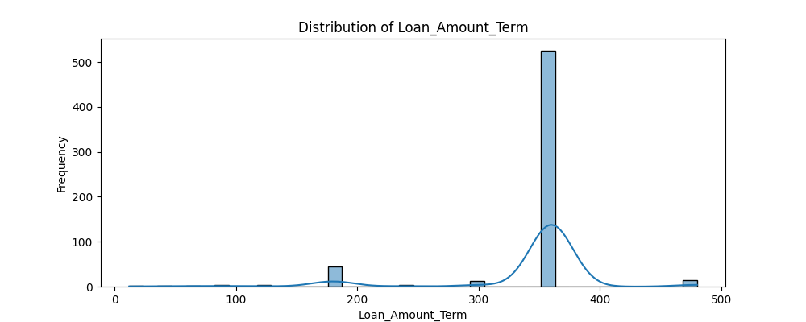
<p align="center">fig 7:data distrubution of Loan_Amount_Term</p>

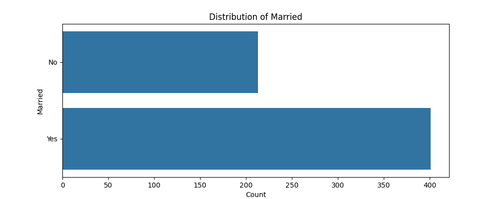
<p align="center">fig 8:data distrubution of Married</p>

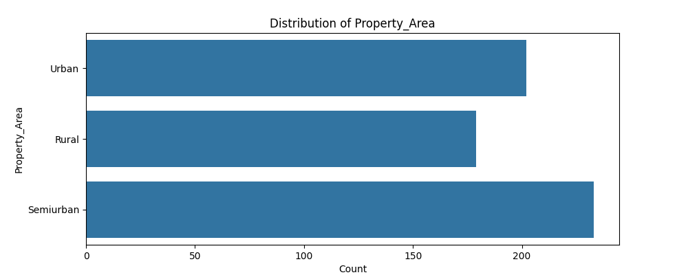
<p align="center">fig 9:data distrubution of Property_Area</p>

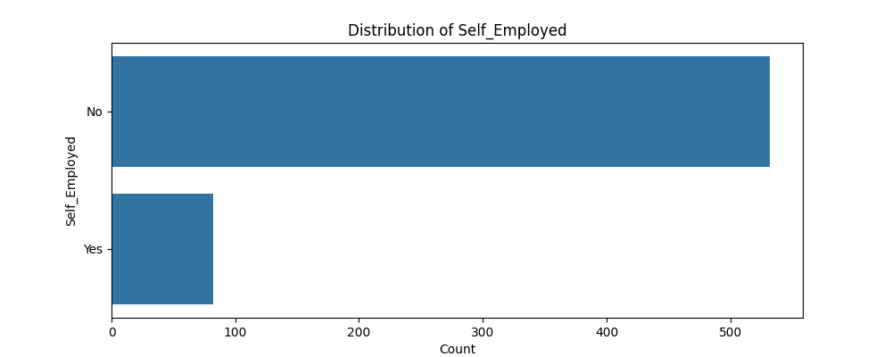
<p align="center">fig 10:data distrubution of Self_Employed</p>

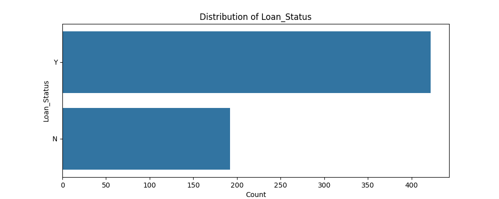
<p align="center">fig 11:data distrubution of Loan_Status</p>


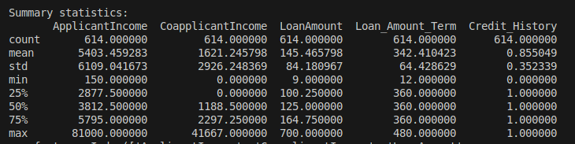
<p align="center">fig 12:data summary</p>

## Data Preprocessing
for preprocessing of the data following methods are applied:
1. Null value detection and inserting mode value in the null values
2. Data encoding process
3. splitting data to training and testing part where training is about 80% of the total data and rest of the 20% for testing
## Model
For loan approval prediction, the LogisticRegression, DecisionTreeClassifier, RandomForestClassifier, and GaussianNB models were implemented and tested. The trained models were saved in the model directory. The model trained with LogisticRegression is saved at model/logistic.pkl, the GaussianNB model is saved at model/nb_model.pkl, and the RandomForest model is saved at model/rfc_re.pkl

### Evaluation of implemented models 
#### RandomForestClassifier:
**confusion matrix  when evaluating randomforest classifier:**

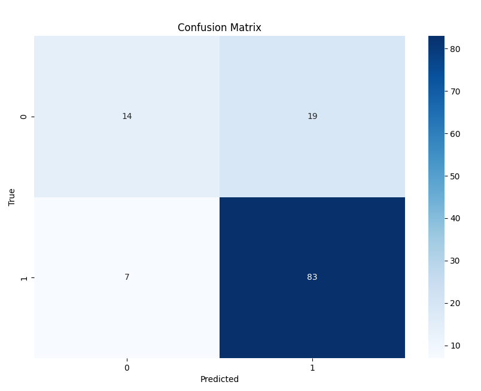

**accuracy,losses and some evaluation matrices:**

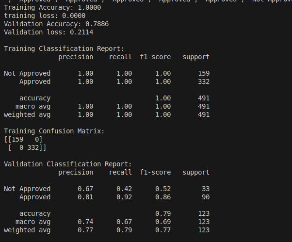
#### GaussianNB:
**confusion matrix  when evaluating the gussian nb model:**

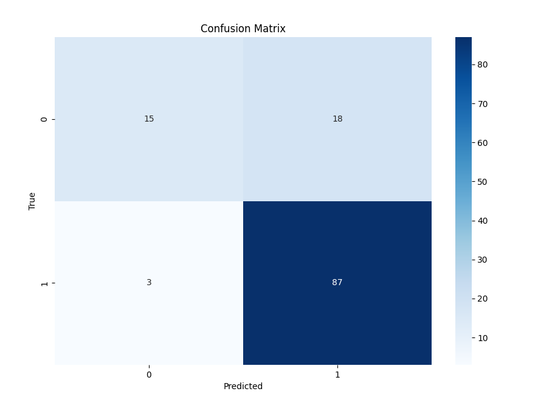

**accuracy,losses and some evaluation matrices:**

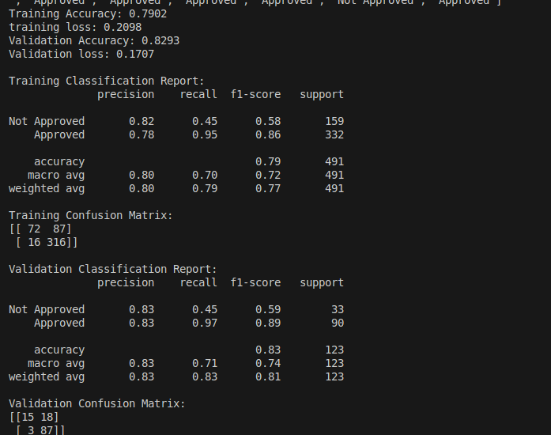

#### DecisionTreeClassifier
**confusion matrix  when evaluating the decision tree classifier:**

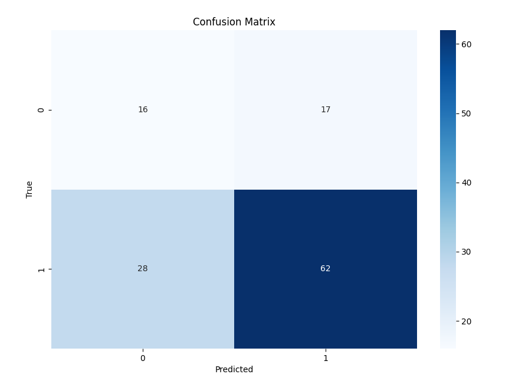

**accuracy,losses and some evaluation matrices:**

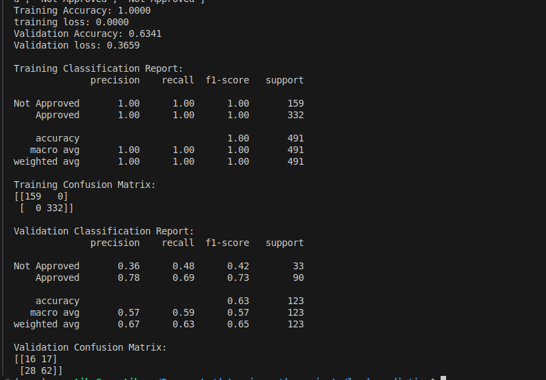

#### LogisticRegression

**confusion matrix  when evaluating the decision tree classifier:**

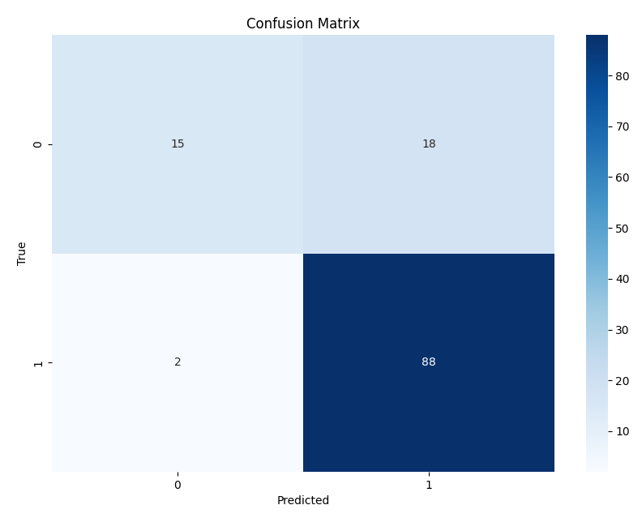

**accuracy,losses and some evaluation matrices:**

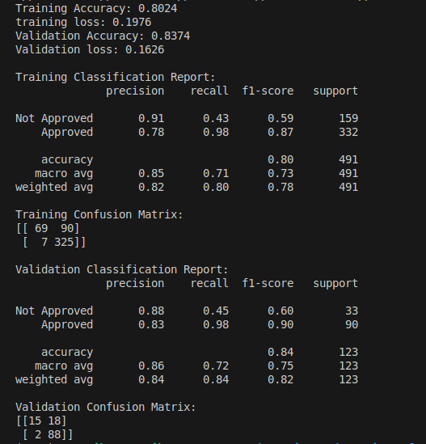

After analyzing the results and evaluations from different models, we observe that, except for the Random Forest classifier, all models exhibit unusual behavior, showing higher training loss and lower validation loss. This behavior may be attributed to factors such as data distribution issues, including class imbalances, noise, and dataset size, which can significantly impact model performance, especially since our data is not balanced.

In contrast, the Random Forest classifier shows higher training accuracy compared to validation accuracy. This discrepancy can be managed by adjusting the number of estimators (i.e., the number of trees) used in the Random Forest model.

## UI  for user interaction using streamlit:


## project discription
**folder hierarchy:**
- loan_prediction
  - data
    - dataset
    - plot
    - encoded.csv
    - preprocess.py
    - preprocessed1.csv
    - model
      - dtc.pkl
      - logstic.pkl
      - model.pkl
      - rfc_re.pkl
  - src
    - evaluate.py
    - model.py
    - train.py
  - utils
  - main.py
  - predict.py
  - requirements.txt

To test the prediction do:
```
python main.py # with streamlit application
predict.py  # without streamlit application

```
for making box section to get input from user use the following format:
```python
gender = st.selectbox("Gender", options=["Male", "Female"])
```
for submission criteria:
```python
if st.button("Submit"):
        new_data = pd.DataFrame({
            'Gender': [gender],
            'Married': [married],
            'Dependents': [dependents],
            'Education': [education],
            'Self_Employed': [self_employed],
            'ApplicantIncome': [applicant_income],
            'CoapplicantIncome': [coapplicant_income],
            'LoanAmount': [loan_amount],
            'Loan_Amount_Term': [loan_amount_term],
            'Credit_History': [credit_history],
            'Property_Area': [property_area]
        })
```
output ui screenshot:
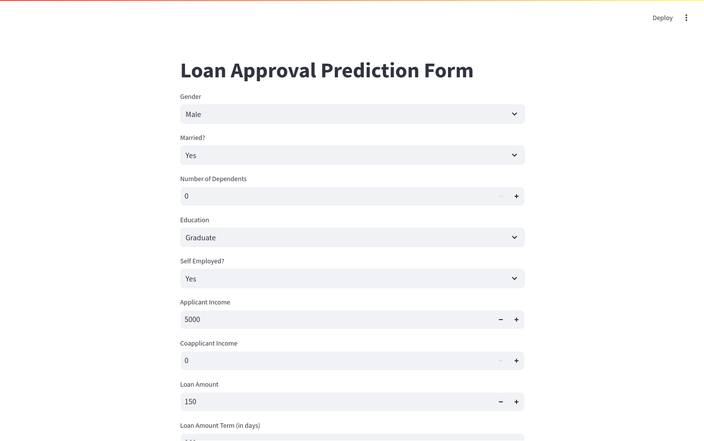
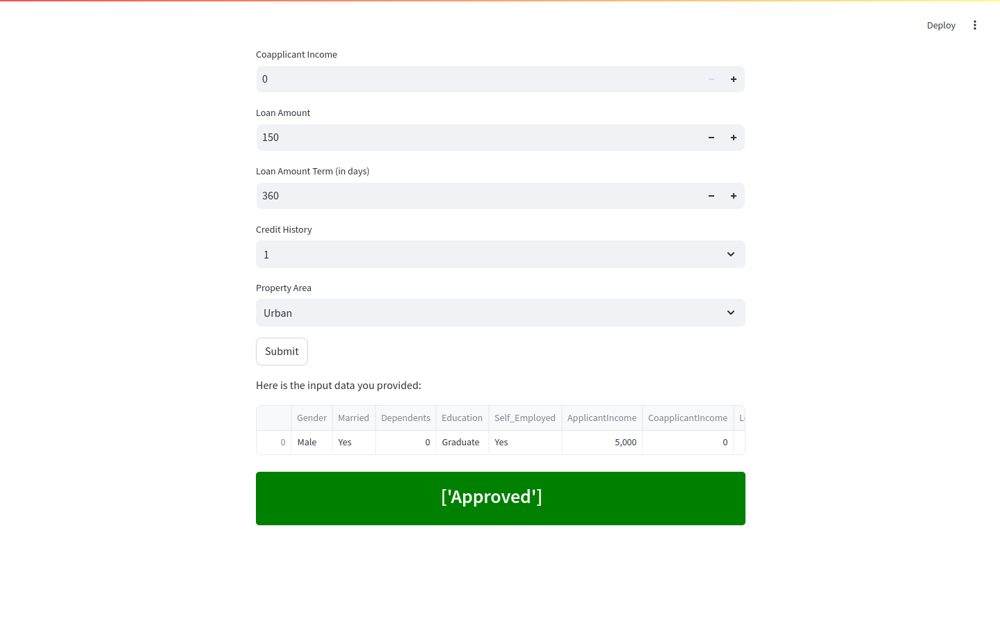


## References
- [https://www.youtube.com/watch?v=x2NrPeHSPU0&t=3119s0](https://www.youtube.com/watchv=x2NrPeHSPU0&t=3119s0)
- [https://www.geeksforgeeks.org/loan-approval-prediction-using-machine-learning/](https://www.geeksforgeeks.org/loan-approval-prediction-using-machine-learning/)
- [https://www.youtube.com/watch?v=x2NrPeHSPU0&t=3119s](https://www.youtube.com/watch?v=x2NrPeHSPU0&t=3119s)


